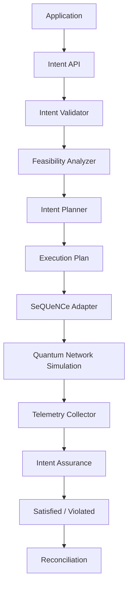

# Arquitetura

## Estado atual (Fase 3, Etapa D)

| Camada do diagrama | Módulo | Status |
|---|---|---|
| Application | (scripts/notebooks do usuário) | conceitual |
| Intent API / Validator | `src/ibqn/intent/` (`models.py`, `parser.py`) | ✅ implementado — validação via pydantic |
| Feasibility Analyzer | `src/ibqn/planning/feasibility.py` | não implementado (Etapa E) |
| Intent Planner | `src/ibqn/planning/planner.py` | não implementado (Etapa E) |
| Execution Plan | `src/ibqn/planning/models.py` | não implementado (Etapa E) |
| SeQUeNCe Adapter | `src/ibqn/network/sequence_adapter.py` | ✅ implementado |
| Quantum Network Simulation | `SeQUeNCe/` (submódulo, commit `1f2680a5`) | reutilizado sem modificação |
| Telemetry Collector | `sequence.utils.metrics` (nativo, envolvido por `execution/sequence_executor.py`) | ✅ parcial — DELIVERY instrumentado; agregação por experimento ainda não existe (Etapa F) |
| Intent Assurance | `src/ibqn/assurance/` | não implementado (Etapa G) |
| Reconciliation | `src/ibqn/assurance/reconciliation.py` | não implementado (Etapa G) |

O corte WHAT/HOW é a decisão central da arquitetura: `EntanglementIntent`
(`src/ibqn/intent/models.py`) descreve apenas requisitos observáveis
(fidelidade mínima, throughput mínimo, número de pares, janela de tempo) —
nunca caminho, nó repetidor, ordem de swap, protocolo/rodadas de purificação,
memórias ou regras. Essas decisões (o HOW) nascem em `planning/` (Etapa E,
ainda não implementada) e, na sua ausência, são hoje delegadas inteiramente
ao mecanismo de reserva padrão do próprio SeQUeNCe (ver
`execution/sequence_executor.py`, docstring do módulo).

## Centralização da integração com o SeQUeNCe

Conforme exigido pelo prompt original (seção 11), toda manipulação direta de
objetos internos do SeQUeNCe está concentrada em exatamente dois arquivos:

- `src/ibqn/network/sequence_adapter.py` — constrói `Timeline` + `RouterNetTopo`
  a partir de `NetworkTopologySpec`; único lugar que instancia objetos de
  topologia do SeQUeNCe.
- `src/ibqn/execution/sequence_executor.py` — subclasse de `RequestApp`
  (`IntentRequestApp`) e orquestração de `NetworkManager.request(...)`;
  único lugar que instancia protocolos/aplicações do SeQUeNCe.

Nenhum outro módulo de `ibqn` importa `sequence.topology`, `sequence.app` ou
`sequence.network_management` diretamente. Detalhes de design e limitações
descobertas durante a implementação estão em `docs/sequence_integration.md`.
