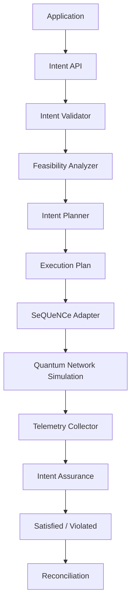

# Arquitetura

## Estado atual (Fase 3, Etapa G)

| Camada do diagrama | Módulo | Status |
|---|---|---|
| Application | (scripts/notebooks do usuário) | conceitual |
| Intent API / Validator | `src/ibqn/intent/` (`models.py`, `parser.py`) | ✅ implementado — validação via pydantic |
| Feasibility Analyzer | `src/ibqn/planning/feasibility.py` | ✅ implementado — estimativas via fórmulas reais do SeQUeNCe |
| Intent Planner | `src/ibqn/planning/planner.py` + `routing.py`/`purification.py`/`swapping.py` | ✅ implementado — estratégias intercambiáveis |
| Execution Plan | `src/ibqn/planning/models.py` | ✅ implementado |
| SeQUeNCe Adapter | `src/ibqn/network/sequence_adapter.py` + `network/capabilities.py` + `ibqn/physics.py` (fórmulas fechadas por formalismo) | ✅ implementado — formalismo `bell_diagonal` por padrão (`docs/physical_model.md`) |
| Quantum Network Simulation | `SeQUeNCe/` (submódulo, commit `1f2680a5`) | reutilizado sem modificação do código-fonte; um patch de runtime documentado (`network/sequence_patches.py`, ver `docs/physical_model.md`) |
| Telemetry Collector | `sequence.utils.metrics` (nativo) + `assurance/telemetry.py` (evidência por intent) | ✅ implementado — ver `docs/assurance_design.md` |
| Cenários / Experiment Runner | `src/ibqn/config/` (`ScenarioSpec`) + `src/ibqn/experiments/` (`Scenario`, `run_scenario`, `seeds_for_trials`) | ✅ implementado — `run_scenario` agora avalia e transiciona todo intent que chega a `ACTIVE` |
| Intent Assurance | `src/ibqn/assurance/evaluator.py` + `violations.py` | ✅ implementado — condições avaliadas via `operator.*`, nunca `eval()` |
| Reconciliation | `src/ibqn/assurance/reconciliation.py` | ✅ implementado — novo episódio (nova `Timeline`), mesmo `IntentRepository` |

O corte WHAT/HOW é a decisão central da arquitetura: `EntanglementIntent`
(`src/ibqn/intent/models.py`) descreve apenas requisitos observáveis
(fidelidade mínima, throughput mínimo, número de pares, janela de tempo) —
nunca caminho, nó repetidor, ordem de swap, protocolo/rodadas de purificação,
memórias ou regras. Essas decisões (o HOW) agora nascem em `planning/`
(`IntentPlanner.plan(intent) -> ExecutionPlan`), que escolhe a rota e decide
se purificação é necessária a partir de estratégias intercambiáveis
(`RoutingStrategy`, `PurificationStrategy`, `SwappingStrategy` — ver
`docs/sequence_integration.md`). O `ExecutionPlan` resultante é executado por
`execution/sequence_executor.py`, que delega a *mecânica* de
geração/purificação/swapping ao próprio SeQUeNCe (nenhuma `Rule` é
construída manualmente nesta versão) — o planner decide a rota, a política
de purificação (`never`/`once`/`until_target`, executada de fato desde a
revisão de realismo físico, ver `docs/physical_model.md`) e se vale a pena
tentar; o núcleo do simulador decide como executar fisicamente (ordem de
swap por bisseção, quando cada regra dispara).

## Centralização da integração com o SeQUeNCe

Conforme exigido pelo prompt original (seção 11), toda manipulação direta de
objetos internos do SeQUeNCe está concentrada em exatamente dois arquivos:

- `src/ibqn/network/sequence_adapter.py` — constrói `Timeline` + `RouterNetTopo`
  a partir de `NetworkTopologySpec`; único lugar que instancia objetos de
  topologia do SeQUeNCe.
- `src/ibqn/execution/sequence_executor.py` (+ `execution/compiler.py`) —
  subclasse de `RequestApp` (`IntentRequestApp`), orquestração de
  `NetworkManager.request(...)` e aplicação da rota escolhida pelo planner
  via `routing_protocol.update_forwarding_rule(...)`; único lugar que
  instancia protocolos/aplicações do SeQUeNCe.

`src/ibqn/network/capabilities.py` e todo `src/ibqn/planning/` são
deliberadamente independentes do SeQUeNCe (só dependem de
`NetworkTopologySpec`, um modelo pydantic puro) — o planejamento acontece
inteiramente antes de qualquer objeto do simulador existir.

Nenhum outro módulo de `ibqn` importa `sequence.topology`, `sequence.app` ou
`sequence.network_management` diretamente. Detalhes de design e limitações
descobertas durante a implementação estão em `docs/sequence_integration.md`.
